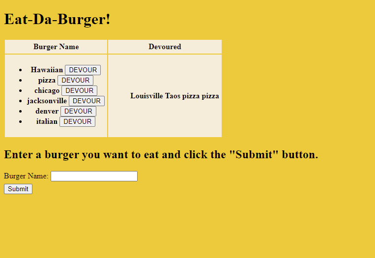

13 Homework Node Express Handlebars Eat A Burger

License Badge: MIT Copyright (c) [Year] [Fullname]

## [Description](#description)

## [Installation](#installation)

## [Usage](#usage)

## [Contributing](#contribute)

## [Tests](#tests)

## Description

Create a buger logger with MySQL, Node, Express, Handlebars and ORM. The app is deployed to Heroku. The app lets the user submit a burger name, it is displayed on the left side, and when the user clicks the Devour button is moves to the right side of page. The instructions include sections on the app setup, the database setup, the config setup, the model setup, the controller setup, the view setup and the directory structure.

## Challenges

There were quite a few challenges getting it all to work together. I was able to get it to finally load into the local host but not to save the user submitted burgers or have them appear under the Burger name and Devoured list.

## Installation

It is deployed on heroku or link in github.

## Usage

Click on the link.

## Contributing

Email

## Tests

Email

## Screenshot

## License

This project is licensed to: MIT Copyright (c) [2021] [Blair Taylor]

## Questions

GitHub username: blairntaylor
Email address: [blairntaylor@gmail.com](mailto:blairntaylor@gmail.com)
